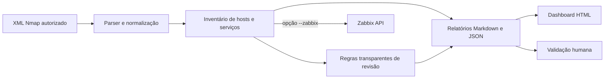

# Network Security Review

[](https://github.com/awakyy1/network-security-review/actions/workflows/ci.yml)


[](LICENSE)


Artefato acadêmico defensivo para transformar XMLs do Nmap em inventário verificável, apontamentos transparentes de revisão de configuração e relatórios em Markdown, JSON e HTML. A exportação de hosts para o Zabbix existe, mas só é executada por opção explícita.

> **TCC aprovado em 19 de novembro de 2025** no curso de Engenharia de Software do Centro Universitário UniOpet, em Curitiba. Autores: João Vitor Ielen e Vinicius Mota Favaro.

[English version](README.en.md) · [Monografia oficial](academic/monografia/monografia-aprovada-2025.pdf) · [Artigo científico](academic/artigo/main.pdf) · [Como citar](CITATION.cff)

## Visão geral

O projeto preserva uma fronteira simples: evidências observadas pelo Nmap são inventário; correspondências com regras são pedidos de revisão; vulnerabilidades só podem ser confirmadas por uma avaliação independente e contextualizada.



### O que o sistema faz

- extrai hosts ativos, endereços, nomes, palpites de sistema operacional e portas abertas;
- conserva os fingerprints de serviço relatados pelo Nmap;
- aplica um conjunto pequeno e documentado de regras de revisão;
- marca todo apontamento com `confirmed_vulnerability: false`;
- gera relatórios portáveis e um dashboard HTML autocontido;
- escapa dados controlados pelo XML antes de renderizá-los em HTML;
- exporta hosts ao Zabbix somente com `--zabbix` e credenciais no ambiente;
- possui testes determinísticos que não exigem varredura real nem instância Zabbix.

### O que o sistema não afirma

Porta aberta não equivale a vulnerabilidade. A versão atual não executa Nmap, não explora serviços, não calcula CVSS, não associa CVEs, não certifica conformidade e não altera regras de firewall. Consulte o [modelo de segurança](docs/SECURITY_MODEL.md) para a semântica completa.

## Execução rápida

Requisito: Python 3.10 ou superior.

```sh
python -m venv .venv
.venv/Scripts/python -m pip install --requirement requirements.txt
.venv/Scripts/python src/nmap_to_zabbix.py
```

Em Linux ou macOS, use `.venv/bin/python`. A configuração padrão processa o exemplo explicitamente sintético em `examples/nmap/synthetic-enterprise.xml` e grava os resultados em `output/`.

```sh
python -m unittest discover -s tests -p "test_*.py" -v
```

O guia completo está em [docs/GETTING_STARTED.md](docs/GETTING_STARTED.md).

## Estrutura do repositório

```text
.
├── academic/              # monografia, artigo, bibliografia e PDFs finais
├── config/                # configuração padrão sem credenciais
├── docs/                  # arquitetura, método, reprodução e segurança
├── examples/nmap/         # XMLs exclusivamente sintéticos
├── src/                   # implementação Python auditada
├── tests/                 # testes unitários e fixtures controladas
├── .github/               # CI, Dependabot e templates de colaboração
├── CITATION.cff           # citação acadêmica legível pelo GitHub
└── README.en.md           # apresentação internacional
```

## Relação entre pesquisa e implementação

O commit pré-banca `dd63d4c` contém o protótipo de 2025, incluindo análise opcional com Ollama, dashboard, heurísticas e integração opcional ao Zabbix. O núcleo atual, endurecido em `b191269`, mantém inventário, regras verificáveis, relatórios e Zabbix, removendo componentes que não possuíam validação experimental suficiente. Essa diferença é documentada em [docs/ACADEMIC_CONTEXT.md](docs/ACADEMIC_CONTEXT.md) e no [histórico](CHANGELOG.md).

## Documentação

- [Contexto acadêmico e banca](docs/ACADEMIC_CONTEXT.md)
- [Arquitetura e fluxo de dados](docs/ARCHITECTURE.md)
- [Metodologia e limites das evidências](docs/METHODOLOGY.md)
- [Guia de reprodução](docs/REPRODUCIBILITY.md)
- [Política dos documentos acadêmicos](docs/DOCUMENT_POLICY.md)
- [Modelo de segurança](docs/SECURITY_MODEL.md)
- [Política de segurança](SECURITY.md)
- [Como contribuir](CONTRIBUTING.md)

## Uso responsável e licença

Use somente dados obtidos com autorização explícita. XMLs e relatórios podem revelar informações sensíveis; não publique inventários reais. Os arquivos em `examples/` e `tests/` são fixtures sintéticas.

O código, os testes, os exemplos sintéticos, as automações e a documentação técnica são disponibilizados sob a [licença MIT](LICENSE). Os documentos em [`academic/`](academic/) estão excluídos dessa licença e permanecem com [todos os direitos reservados](academic/LICENSE.md). A divisão completa está em [LICENSING.md](LICENSING.md); a autoria e a citação recomendada, em [CITATION.cff](CITATION.cff).
