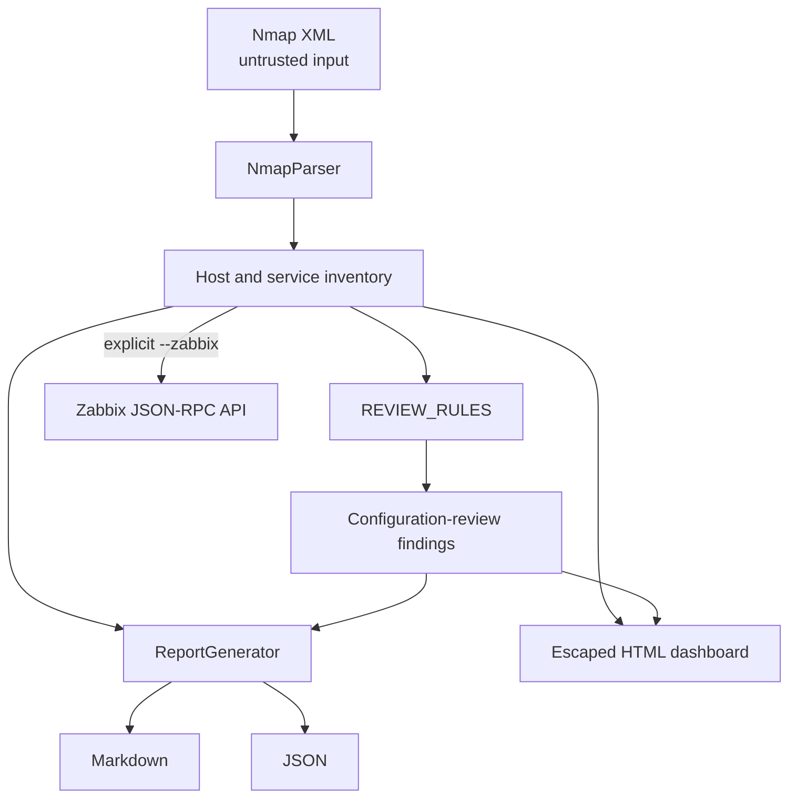
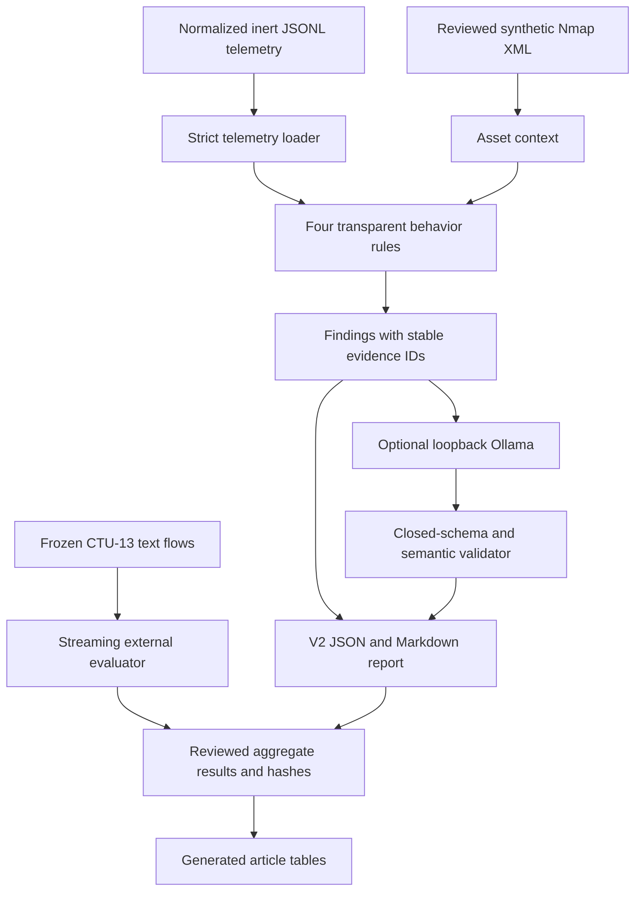

# Architecture

## Component view

### Operational inventory path

| Component | Responsibility | Side effects |
|---|---|---|
| `NmapParser` | Parse live hosts and open services from local XML | Reads one local file |
| `REVIEW_RULES` | Match observable service/port evidence to review wording | None |
| `ReportGenerator` | Serialize inventory and findings | Writes Markdown and JSON |
| `generate_technical_dashboard` | Render an escaped, self-contained dashboard | Writes HTML |
| `ZabbixAPI` | Authenticate and create inventory hosts | Remote mutation; explicit only |

### V2 research path

| Component | Responsibility | Side effects |
|---|---|---|
| `TelemetryEvent` loader | Validate normalized timestamps, event types and unique evidence IDs | Reads local JSONL |
| `BehaviorDetector` | Emit auditable review findings for four frozen behavior rules | None |
| `OllamaAdvisor` | Request schema-constrained prioritization from loopback Ollama | Local HTTP request only |
| Grounding validator | Reject unknown citations, unsafe claims and inapplicable controls | None |
| Repetition/preservation tools | Run fixed protocols, retain raw output and record hashes | Writes ignored runs or reviewed evidence |
| CTU-13 evaluator | Stream frozen labeled flow text and compute separated metrics | Reads ignored external data; writes aggregate reports |
| Article table generator | Project preserved JSON into LaTeX | Writes generated table fragments |

## Data flow and invariants

1. A previously authorized Nmap process produces XML; this repository never launches Nmap.
2. Only hosts whose state is `up` and ports whose state is `open` enter the inventory.
3. Missing fingerprints receive explicit neutral defaults rather than inferred products.
4. A rule match creates a review prompt with evidence, recommendation and triage severity.
5. Every rule-generated item keeps `classification: configuration-review` and `confirmed_vulnerability: false`.
6. Reports preserve observations and derived findings as separate structures.
7. Zabbix export occurs only when the operator passes `--zabbix`.
8. V2 telemetry labels remain outside event files and outside Ollama prompts.
9. Every V2 finding carries exact event IDs and explicit non-confirmation fields.
10. The local model receives evidence but no system, Zabbix or firewall credential.
11. Schema-valid output is still subject to deterministic semantic validation.
12. External CTU-13 source files remain ignored; only frozen manifests, hashes
    and reviewed aggregate/anonymized results are versioned.

## Trust boundaries

Nmap XML is untrusted input. Its values are treated as text and escaped before HTML rendering. Markdown and JSON can still disclose hostnames, addresses and fingerprints, so output remains sensitive even when code injection is prevented.

Zabbix is an external privileged system. Credentials are read only from environment variables; TLS certificate verification is enabled by default; requests have a finite timeout. The current integration creates objects but does not reconcile, update or delete them.

Ollama is an untrusted advisory boundary even though it runs locally. The URL is
restricted to loopback, responses are stored before interpretation, and the
validator mediates citations and controls. No path connects accepted output to
an automatic response mechanism.

The CTU-13 adapter is a research-only offline boundary. It permits only the
frozen text-flow sources declared by URL, byte length and SHA-256; it never
acquires or executes malware binaries.

## Extension criteria

New rules must be explainable from observable fields and worded as review questions. CVE matching would require a separate, authoritative and freshness-aware component with normalized product identifiers, affected-version evaluation and provenance. Automated firewall changes remain outside the current trust boundary and would require approval, minimum scope, expiration, audit logging and rollback.
