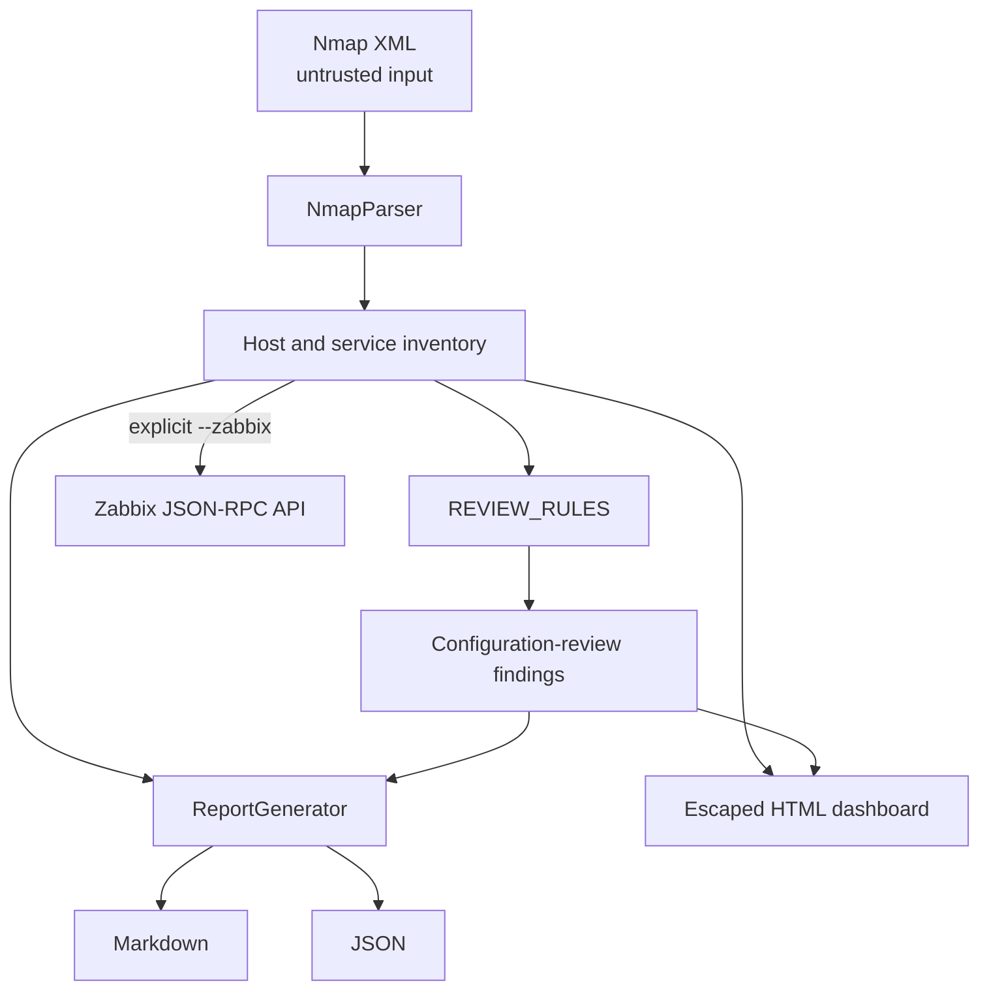

# Architecture

## Component view

| Component | Responsibility | Side effects |
|---|---|---|
| `NmapParser` | Parse live hosts and open services from local XML | Reads one local file |
| `REVIEW_RULES` | Match observable service/port evidence to review wording | None |
| `ReportGenerator` | Serialize inventory and findings | Writes Markdown and JSON |
| `generate_technical_dashboard` | Render an escaped, self-contained dashboard | Writes HTML |
| `ZabbixAPI` | Authenticate and create inventory hosts | Remote mutation; explicit only |

## Data flow and invariants

1. A previously authorized Nmap process produces XML; this repository never launches Nmap.
2. Only hosts whose state is `up` and ports whose state is `open` enter the inventory.
3. Missing fingerprints receive explicit neutral defaults rather than inferred products.
4. A rule match creates a review prompt with evidence, recommendation and triage severity.
5. Every rule-generated item keeps `classification: configuration-review` and `confirmed_vulnerability: false`.
6. Reports preserve observations and derived findings as separate structures.
7. Zabbix export occurs only when the operator passes `--zabbix`.

## Trust boundaries

Nmap XML is untrusted input. Its values are treated as text and escaped before HTML rendering. Markdown and JSON can still disclose hostnames, addresses and fingerprints, so output remains sensitive even when code injection is prevented.

Zabbix is an external privileged system. Credentials are read only from environment variables; TLS certificate verification is enabled by default; requests have a finite timeout. The current integration creates objects but does not reconcile, update or delete them.

## Extension criteria

New rules must be explainable from observable fields and worded as review questions. CVE matching would require a separate, authoritative and freshness-aware component with normalized product identifiers, affected-version evaluation and provenance. Automated firewall changes remain outside the current trust boundary and would require approval, minimum scope, expiration, audit logging and rollback.
